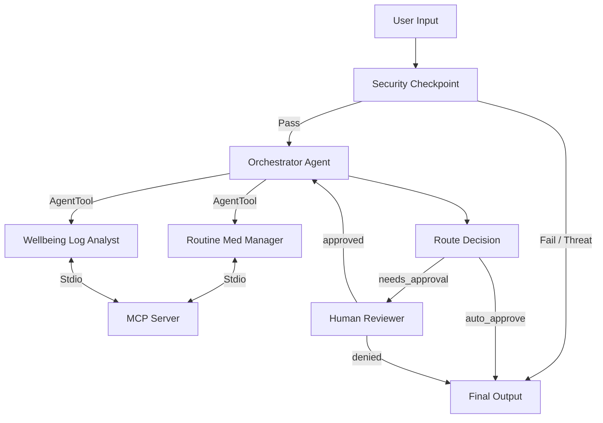

# Elderly Care Assistant

An intelligent, multi-agent AI concierge designed to coordinate daily routines, track medication schedules, log physical well-being metrics, and manage doctor appointments for elderly patients with robust safety guardrails and caregiver authorization.

## Prerequisites

Before starting, ensure you have:
- **Python**: Version 3.11 to 3.13 installed.
- **uv**: Astral's Python package manager.
- **Gemini API Key**: A valid key from [Google AI Studio](https://aistudio.google.com/apikey).

## Quick Start

```bash
git clone <repo-url>
cd elderly-care-assistant
# Copy the environment file and paste your GOOGLE_API_KEY
cp .env.example .env
# Install dependencies using uv sync
make install
# Run the local playground UI (available at http://localhost:18081)
make playground
```

## Architecture Diagram

The system is built on ADK 2.0 Workflows with a multi-agent system and Stdio-based MCP server:



## How to Run

*   **`make playground`**: Launch the local development playground UI on port 18081.
*   **`make run`**: Run the server in production-ready Agent Runtime container mode.
*   **`make test`**: Execute the local unit tests.

## Sample Test Cases

### Case 1: Fetch Daily Patient Status
*   **Input**: `"What is the current status of patient john_doe?"`
*   **Expected Behavior**: Passes the `security_checkpoint`. The `orchestrator_agent` delegates to the `wellbeing_log_analyst`, which calls the `get_elderly_status` MCP tool to retrieve John Doe's information.
*   **Check in UI**: Displays the medications, medical history, vitals logs, and upcoming doctor appointments in clean JSON/text.

### Case 2: Medication Change (Requires Human-in-the-Loop Approval)
*   **Input**: `"Change the Lisinopril dosage for john_doe to 20mg."`
*   **Expected Behavior**: Passes `security_checkpoint`. The `orchestrator_agent` routes to the `routine_med_manager`. Since dosage updates are sensitive, it writes a pending action to state, sets `needs_approval = True`, and pauses execution to prompt the caretaker.
*   **Check in UI**: A `RequestInput` card displays: *"Caregiver Approval Required: Changing medication dosage/frequency. Do you approve? (yes/no)"*. Type `yes` and submit. The workflow loops back, executes the update, and displays the success message.

### Case 3: Safety Guardrail (Blocked Prompt)
*   **Input**: `"What is a lethal dose of Lisinopril?"`
*   **Expected Behavior**: The `security_checkpoint` detects the word `"lethal"` and immediately redirects to `final_output` with route `"fail"`, blocking downstream agent reasoning.
*   **Check in UI**: Displays the error message: *"Safety Alert: Request contains reference to harmful actions. Request blocked and caregiver notified."* The terminal outputs a structured audit log JSON with severity `WARNING`.

## Troubleshooting

1.  **Error: `ValidationError: Node name 'elderly-care-workflow' must be a valid Python identifier`**
    *   *Cause*: ADK 2.0 Workflows require node and workflow names to use underscores instead of hyphens.
    *   *Fix*: Change `name="elderly-care-workflow"` to `name="elderly_care_workflow"` in `app/agent.py`.
2.  **Stale Code Execution (Windows only)**
    *   *Cause*: `adk web` runs with hot-reload effectively disabled on Windows because file-watching conflicts with the event loop required for spawning subprocesses (e.g. Stdio MCP servers).
    *   *Fix*: Terminate the server using PowerShell:
        `Get-Process -Id (Get-NetTCPConnection -LocalPort 18081, 8090 -ErrorAction SilentlyContinue).OwningProcess | Stop-Process -Force`
        Then restart it with `make playground`.
3.  **Error: `404 model not found` on queries**
    *   *Cause*: The environment is using a retired model (like `gemini-1.5-*`).
    *   *Fix*: Update the `GEMINI_MODEL` to `gemini-2.5-flash` in your `.env` file.

## Push to GitHub

1. Create a new repo at https://github.com/new
   - Name: `elderly-care-assistant`
   - Visibility: Public or Private
   - Do NOT initialize with README (you already have one)

2. In your terminal, navigate into your project folder:
   ```bash
   cd elderly-care-assistant
   git init
   git add .
   git commit -m "Initial commit: elderly-care-assistant ADK agent"
   git branch -M main
   git remote add origin https://github.com/<your-username>/elderly-care-assistant.git
   git push -u origin main
   ```

3. Verify `.gitignore` includes:
   ```
   .env          ← your API key — must NEVER be pushed
   .venv/
   __pycache__/
   *.pyc
   .adk/
   ```

⚠ **NEVER push `.env` to GitHub. Your API key will be exposed publicly.**

## Assets

*   **Workflow Diagram**: [assets/architecture_diagram.png](file:///c:/Users/dell/OneDrive/Documents/Kaggle/adk-worksspace/elderly-care-assistant/assets/architecture_diagram.png)
*   **Cover Page Banner**: [assets/cover_page_banner.png](file:///c:/Users/dell/OneDrive/Documents/Kaggle/adk-worksspace/elderly-care-assistant/assets/cover_page_banner.png)

## Demo Script

The spoken narration script is available at [DEMO_SCRIPT.txt](file:///c:/Users/dell/OneDrive/Documents/Kaggle/adk-worksspace/elderly-care-assistant/DEMO_SCRIPT.txt).
