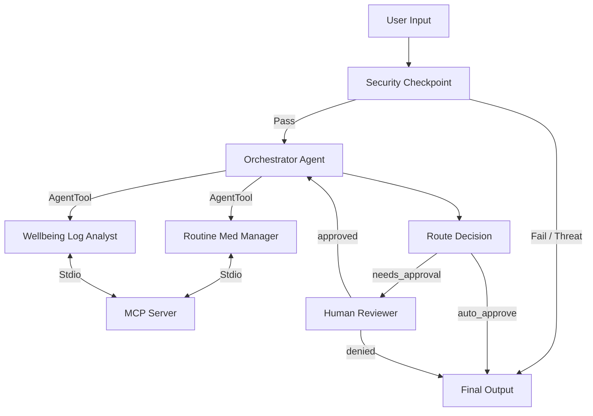

# Submission Write-Up: Elderly Care Assistant

## Problem Statement

As the global population ages, millions of elderly individuals require regular care, medication monitoring, vital logging, and doctor coordination. Caregivers (often family members or professional health aids) face severe cognitive overload trying to manage schedules, track logs, and update medical dosages. Existing consumer options are either simple, dumb alarm clocks or full medical record systems that are overly complex and lack interactive support. 

The **Elderly Care Assistant** provides a secure, smart, and interactive concierge that assists patients and caretakers in tracking routines and symptoms, whilst introducing strict security filters and human-in-the-loop approval gates for critical actions (such as medication alterations or appointment bookings) to prevent medical accidents or uncoordinated activities.

## Solution Architecture

The solution uses ADK 2.0's Graph-based Workflow API to enforce a rigid execution pipeline, ensuring input safety and authorization gates are executed deterministically before any sub-agent can invoke destructive tool calls:

## Concepts Used & File References

1.  **ADK Workflow Graph API**: Structured in `app/agent.py` as `root_agent = Workflow(...)`, utilizing nodes and edges for flow management.
2.  **LlmAgent Sub-Agents**: Specialized agents `routine_med_manager` and `wellbeing_log_analyst` are created in `app/agent.py` using `LlmAgent`.
3.  **AgentTool Delegation**: `orchestrator_agent` (in `app/agent.py`) uses `AgentTool(routine_med_manager)` and `AgentTool(wellbeing_log_analyst)` to delegate task planning and reasoning.
4.  **MCP Server**: Implemented in `app/mcp_server.py` as an independent Stdio-based process, exposing five custom tools that read/write to the JSON database.
5.  **Security Checkpoint**: The first node in `app/agent.py`, `security_checkpoint()`, acts as a pre-execution filter scanning for PII, prompt injections, and health safety risks.
6.  **Agents CLI**: Project scaffolded using `agents-cli scaffold create` and configured with pinned dependencies in `pyproject.toml` and standard commands in `Makefile`.

## Security Design

Elderly care systems deal with highly sensitive patient information. Our safety controls include:
*   **PII Redaction**: Regular expressions in `security_checkpoint` scan for and replace Social Security Numbers (SSNs) and phone numbers with redaction tags before the user input is sent to the LLM, protecting patient privacy.
*   **Prompt Injection Detection**: Scans for keywords like "override instruction" or "bypass rules" to prevent malicious prompts from tricking the LLM into skipping safety protocols or changing data arbitrarily.
*   **Lethal/Harm Filtering**: The assistant blocks requests containing dangerous words like "overdose", "poison", or "lethal dose", preventing accidental prompts or self-harm/misinformation requests from being processed.
*   **Structured Audit Logging**: Outputs JSON audit logs containing input metadata, security check statuses, and severity levels (`INFO`, `WARNING`, `CRITICAL`) to stdout for integration with cloud logging services.

## MCP Server Design

The MCP server (`app/mcp_server.py`) operates as a separate process using the FastMCP framework over stdio:
*   `get_elderly_status`: Retrieves the patient's full JSON profile (meds, log history, and calendar).
*   `update_medication`: Inserts or modifies medication records in the JSON database.
*   `log_medication_taken`: Logs timestamped medication compliance.
*   `add_wellbeing_log`: Captures vitals (blood pressure, heart rate, temperature) and symptoms, flagged as `warning` if outside normal bounds.
*   `book_appointment`: Schedules a doctor's appointment in the patient's record.

## Human-in-the-Loop (HITL) Flow

To prevent accidental modification of medical regimens or unapproved appointments, the agent restricts direct tool usage:
1.  When a user asks to modify a medication dosage or book an appointment, the specialized sub-agent writes the pending details to the session state and sets `needs_approval = True` without invoking the write tool.
2.  The workflow's `route_decision` node reads the flag and redirects to the `human_reviewer` node.
3.  The `human_reviewer` yields a `RequestInput` event, pausing the conversation run and prompting the caregiver in the UI.
4.  Once the caregiver replies `yes`, the workflow resumes, sets the state's `approval_status = "approved"`, and loops back to the `orchestrator_agent` to invoke the write tool and apply changes.

## Demo Walkthrough

The demo includes three distinct scenarios tested in the local playground:
1.  **Read-Only Request**: Fetching patient vitals automatically retrieves the data through the `wellbeing_log_analyst` sub-agent.
2.  **Dosage Change (HITL)**: Requesting a dosage increase triggers a caregiver approval prompt. Approving it modifies the database and confirms the change.
3.  **Abuse Check (Block)**: Searching for "lethal dose" triggers the safety filter, outputting a warning in the logs and blocking the response.

## Impact & Value Statement

The **Elderly Care Assistant** lowers the burden on caregivers by centralizing patient data under an intelligent, natural-language interface. The multi-agent delegation keeps queries focused, while the strict Workflow structure and security checkpoint prevent LLM hallucinations from making dangerous medical updates. This system bridges the gap between passive calendars and unsafe, autonomous LLMs, offering a secure tool for family caretakers and clinical providers alike.
